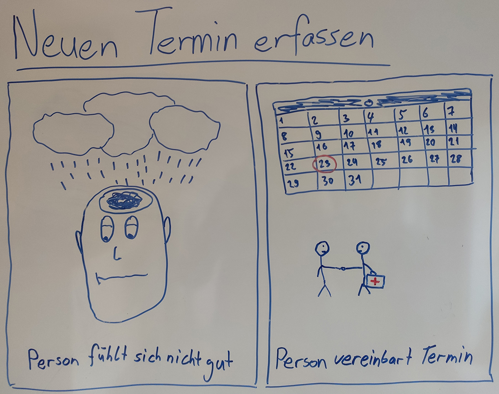
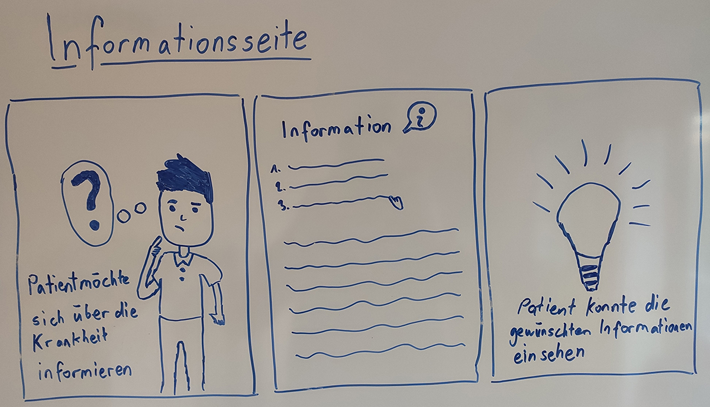
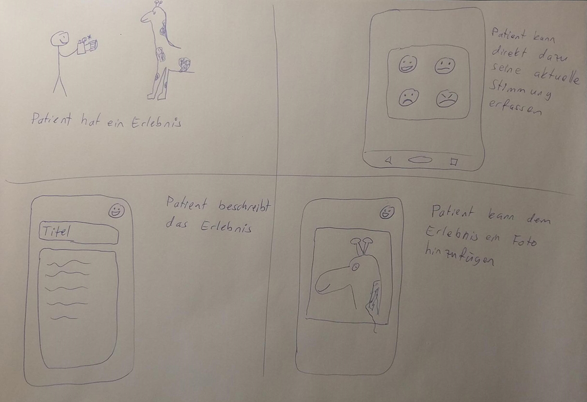
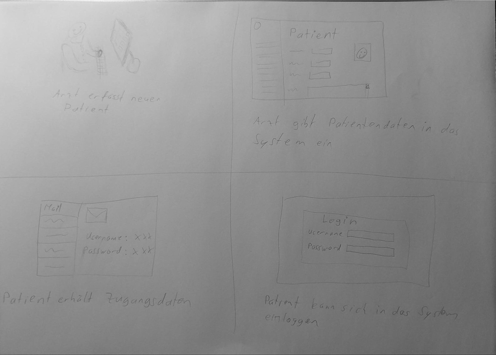
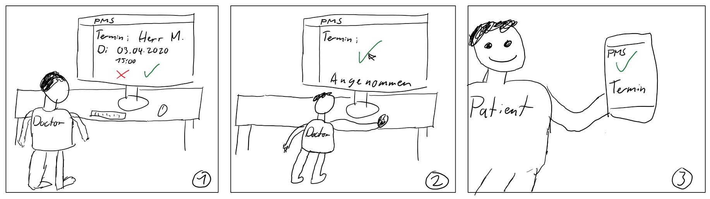
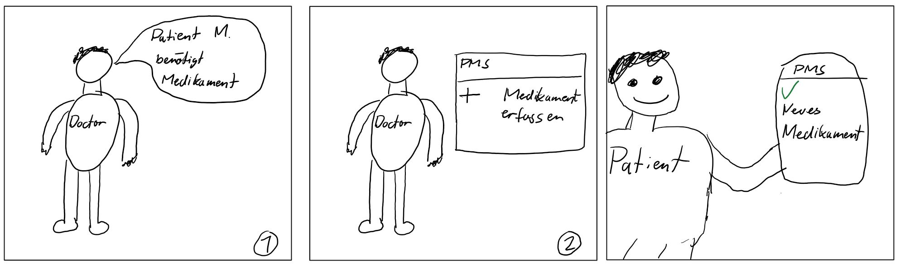
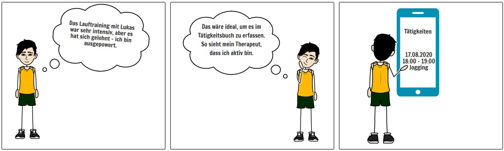
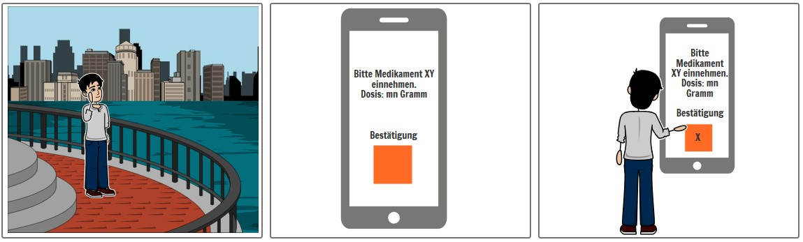
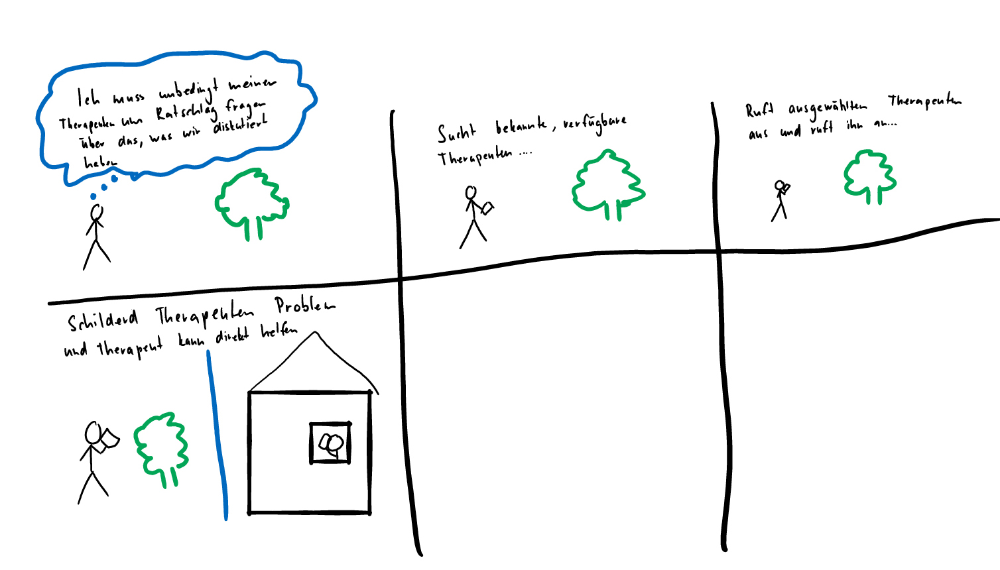
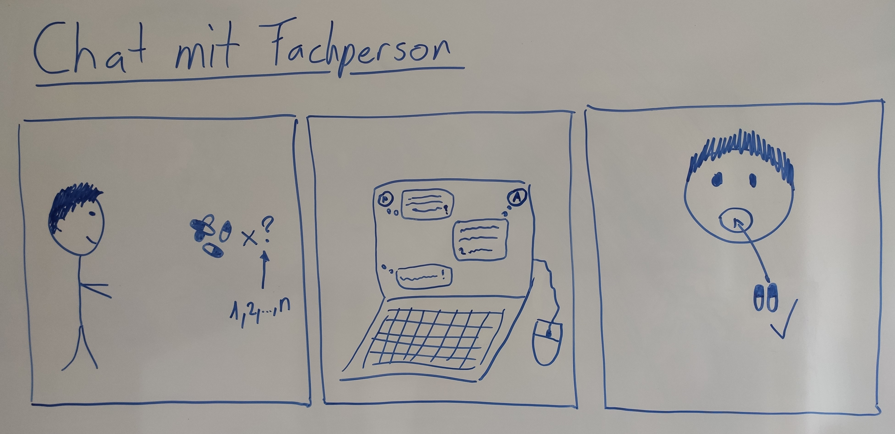

# Storyboards

## Neuen Termin erfassen

## Informationsseite

## Stimmung erfassen

## Neuen Patienten im System registrieren

## Therapeut bestätigt Patiententermin

## Therapeut fügt neues Medikament für Patient hinzu

## Eintrag Tätigkeitsbuch

## Erinnerung an Medikamenteneinnahme

## Im Notfall einen Therapeuten anrufen

## Notruf wählen (Button)

")

## Chatfunktion mit Fachperson

