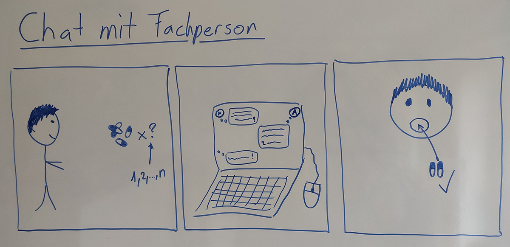

# Storyboards

## Neuen Termin erfassen
Der Patient will einen Termin mit dem Arzt/Therapeut machen. Über das App kann er bei seinem Arzt einen neuen Termin anfragen.

## Informationsseite
Bei Patient wurde eine Diagnose erstellt. Der Patient will sich nun weiter über diese Krankheit informieren.

## Stimmung erfassen
Um seine Stimmung über eine gewisse Zeit zu erfassen und analysieren, kann der Patient in regelmässigen Abständen seine Stimmung.

## Neuen Patienten im System registrieren
Der Arzt hat einen neuen Patienten und will diesen im System registrieren, damit der Patient die Funktionen verwenden kann. 

## Therapeut bestätigt Patiententermin
Eine angefragte Terminanfrage von Patienten wird durch den Therapeuten bestätigt. Patient erhält anschliessend Bestätigung.

## Therapeut fügt neues Medikament für Patient hinzu
Der Patient muss verschiedene Medikamente einnehmen. Der Therapeut erfässt dazu, welches Medikament er wie häufig einnehmen muss.

## Eintrag Tätigkeitsbuch
Analog zur Stimmung kann ein Patient seine Tätigkeiten erfassen. Diese kann er dann chronologisch sortiert einsehen.

## Erinnerung an Medikamenteneinnahme
Der Therapeut hat dem Patienten ein neues Medikament hinzugefügt. Nun soll der Patient erinnert werden, dass er das Medikament einnehmen muss. 

## Im Notfall einen Therapeuten anrufen
Der Patient hat ein dringendes Anliegen und muss unbedingt einen vertrauen Therapeuten kontaktieren.

## Notruf wählen (Button)
Der Patient hat einen Notfall. Er muss unbedingt mit irgendeinem Arzt reden. Mit dem Drücken des Notfall-Buttons wird automatisch der Notfall gewählt und der Patient wird mit der Zentrale verbunden.
")

## Chatfunktion mit Fachperson
Der Patient will sich über sein Befinden mit einer Fachperson austauschen. Auch Themen wie Tipps holen etc. können hier auftreten. 

