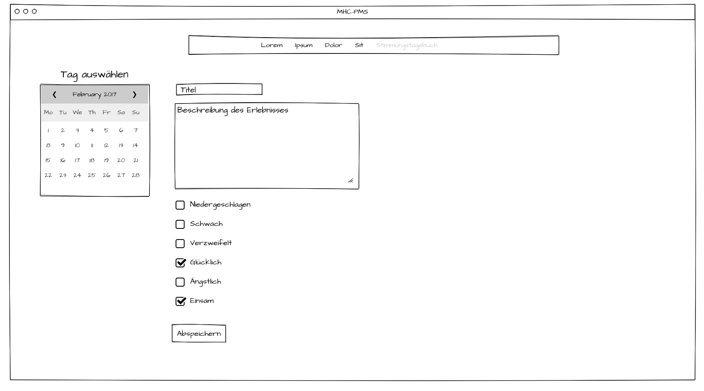
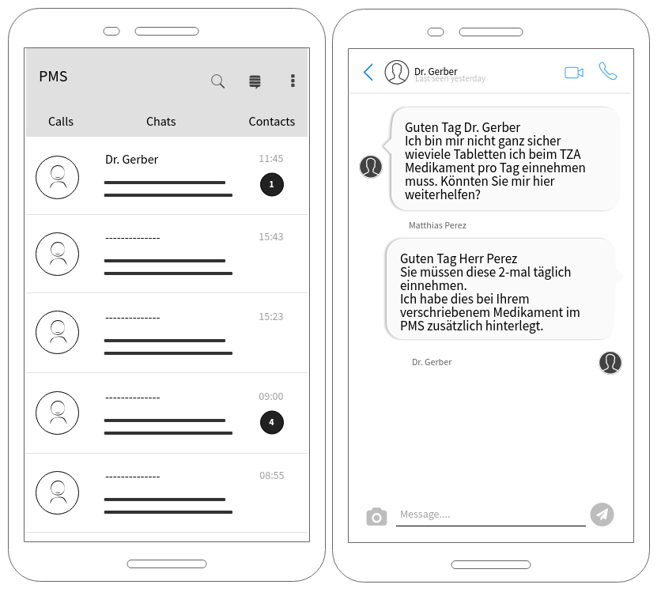

# Prototypes

## Eintrag im Stimmungstagebuch
Zum Verfolgen der Stimmung über eine gewisse Zeit, erfässt der Patient seine Stimmung und Aktivität regelmässig. In einem nächsten Schritt, kann der Patient den Verlauf und die Entwicklung sehen. Dabei muss der Tag, die Stimmung sowie ein kleiner Beschrieb erfasst werden. 

## Neues Medikament erfassen
Der Arzt hatte bspw. gerade einen Termin mit dem Patienten. Dabei ist herausgekommen, dass der Patient neu regelmässig ein Medikament einnehmen muss. Damit der Patient erinnert wird, erfässt der Arzt dazu, das Medikament und weist die Einnahme einem Benutzer zu. Der Arzt wählt dazu folgende Felder aus:
- Medikament
- Patient
- Dosierung (für jedes Medikament/Patient separat)
- Häufigkeit & Uhrzeit (für jedes Medikament/Patient separat)

(Nicht vollständig, da scollbar)

## Chatfunktion mit Fachperson
Der Patient will sich über sein Befinden mit einer Fachperson austauschen. Zusätzlich will er seine Fragen klären und Hilfe anfragen. 

