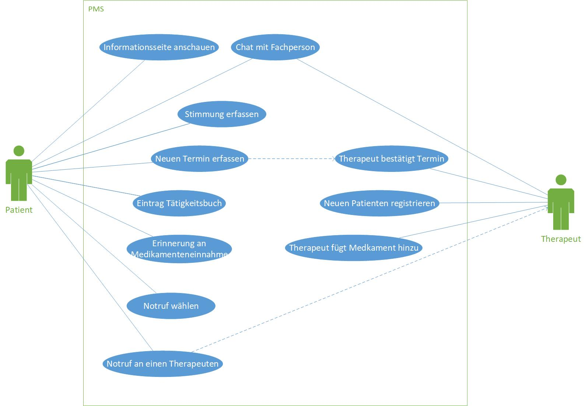

# User Requirements
Im Use-Case-Daigram wurden allen Use-Cases aus Task 01 abgebildet und unten in Verbindung mit Ihren Aktoren gesetzt.
Wichtig für uns ist die Umsetzung der im Diagram abgebildeten Use-Cases.
Es ist durchaus denkbar, dass im Verlauf der Enticklung des PMS noch Abhängigkeiten von bestimmten Use-Cases angepasst werden müssen.
## Auflistung Use-Cases 

Nr. | Use-Case
-----|-------
01 | Neuen Termin erfassen
02 | Informationsseite
03 | Stimmung erfassen
04 | Neuen Patienten im System registrieren
05 | Therapeut bestätigt Patiententermin
06 | Therapeut fügt neues Medikament für den Patienten hinzu
07 | Eintrag ins Tätigkeitsbuch
08 | Erinnerung an die Medikamenteneinnahme
09 | Im Notfall einen Therapeuten anrufen
10 | Notruf wählen
11 | Chatfunktion mit Fachperson

***

### Use Case 1

Was | Text
-----|--------
Nr. und Name | Nr. 11 Chatfunktion mit Fachperson
Szenario | Der Patient ist sich unsicher bei seiner Behandlung oder will den Therapeuten über etwas informieren.
Kurzbeschreibung | Der Patient ist sich bezüglich der Wirkung/Nutzen eines Medikaments unsicher und öffnet das PMS, um mit seinem Therapeuten zu chatten. Der Therapeut kann dem Patienten gleich antworten und ihm die nötigen Informationen mitteilen.
Beteiligte Akteure | Patient & Therapeut
Auslöser/Vorbedingung | Eine Sache ist unklar oder der eine der Parteien will Informationen austauschen.
Ergebnisse/Nachbedingung | Der Patient ist beruhigt und weiss was er tun muss. Der Therapeut ist über die Lage des Patienten informiert.

#### Ablauf

Nr. | Wer | Was
-----|--------|--------
01 | Patient | Ist Unsicher über die Wirkungen eines Medikaments
02 | Patient | Öffnet den Chat mit dem Therapeuten im PMS
03 | Patient | Schreibt dem Therapeuten sein Anliegen
04 | Therapeut | Erhält eine Benachrichtigung im PMS, dass eine neue Nachricht von Patient vorliegt.
05 | Therapeut & Patient | Konversation im PMS
06 | Therapeut und Patient| Sind informiert über die gegenseitige Lage

#### Ausnahmen/Varianten

Nr. | Wer | Was
-----|--------|--------
01 | Therapeut | Die Anfrage des Patienten ist kompliziert und daher ruft ihn der Therapeut direkt an
02 | Patient | Der Therapeut antwortet nicht sofort und daher ruft er den Therapeuten direkt an.
03 | Patient | Die Antowrten im Chat reichen ihm nicht aus und er vereinbart einen Termin mit dem Therapeuten

***

### Use Case 2

Was | Text
-----|--------
Nr. und Name | 03 Stimmung erfassen
Szenario | Der Patient muss jeden Tag seine Stimmung im PMS erfassen.
Kurzbeschreibung | Am Abend öffnet der Patient das PMS und trägt im heutigen Tag ein wie er seine Stimmung wargenommen hat und schreibt vielleicht noch einen Kommentar.
Beteiligte Akteure | Patient (Therapeut schaut sich das Tagebuch anschliessend an)
Auslöser/Vorbedingung | Patient ist vom Therapeut aufgefordert seine Stimmung täglich zu erfassen um den Fortschritt zu tracken.
Ergebnisse/Nachbedingung | Der Therapeut erhält eine Übersicht über den Verlauf der Stimmung des Patienten während der Behandlungsdauer.

#### Ablauf

Nr. | Wer | Was
-----|--------|--------
01 | Patient | Öffnet das PMS um seinen täglichen Eintrag über seine Stimmung zu machen.
02 | Patient | Beschreibt seine Stimmung anhand von verscheidenen Smileys und fügt optional noch einen Kommentar hinzu.
03 | Patient & Therapeut | Sehen den Verlauf der Stimmung des Patienten über den Behandlungszeitraum

#### Ausnahmen/Varianten

Nr. | Wer | Was
-----|--------|--------
01 | Patient | Wenn die Stimmung nach 20:00Uhr noch nicht erfasst ist, könnte der Patient eine Push-Benachrichtigung erhalten.
02 | Patient | Vergisst den Eintrag zu machen, so muss er diesen am nächsten Tag nachholen und die Verspätung wird im PMS vermerkt.
03 | Therapeut | Kann den Patienten auffordern, detaillierter über seine Stimmung zu schreiben.

***
