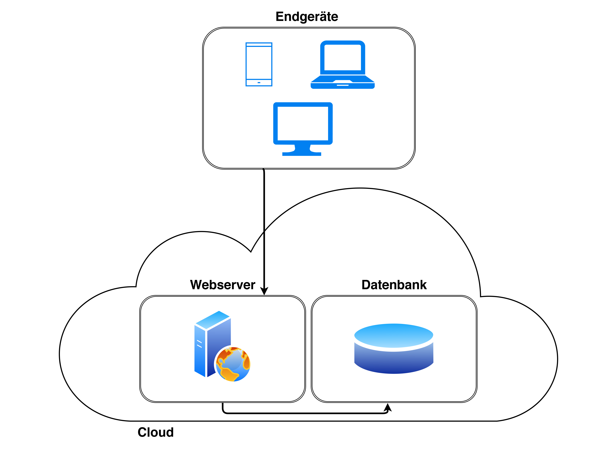

<!-- Bitte Unterkapitel mit ### fortführen damit das Dokument nach dem Merge dann bereits sauber gegliedert ist -->
## System architecture

Die Endversion dieser Applikation wird eine Webapplikation sein, welche über Laptops, Computer und Smartphones über einen modernen Browser abrufbar ist. Damit die Applikation überall identisch ist und die gleichen Funktionen bietet, wird ein responsive Design erstellt.

Die Business Logik wird in Java geschrieben. Jegliche Daten werden nur im Backend auf der Datenbank abgelegt und nicht auf einem Endgerät des Kunden. Installationen sind keine notwendig.

Unser Webserver sowie die Datenbank werden in der Cloud von einem Schweizer Hoster zur Verfügung gestellt. Der Webserver nimmt alle Anfragen des Kunden entgegen und sendet die Antworten zurück an den Kunden.