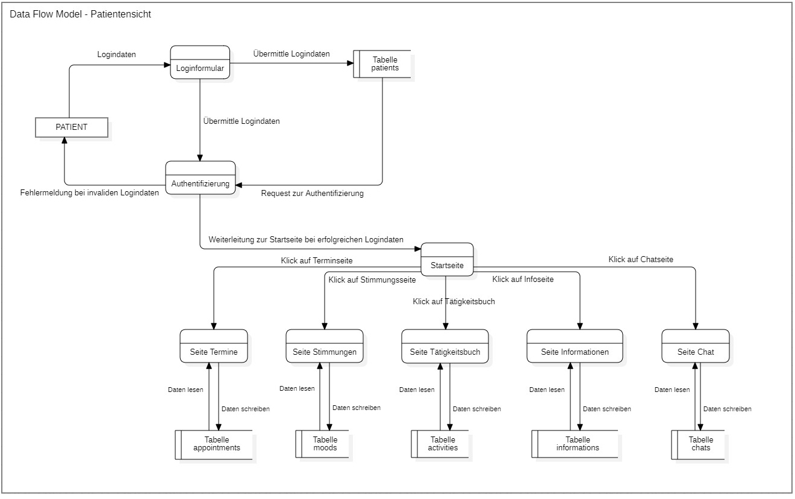

<!-- Bitte Unterkapitel mit ### fortführen damit das Dokument nach dem Merge dann bereits sauber gegliedert ist -->
## System models

Das Datenflow-Diagramm zeigt aus der Sicht eines Patienten, wie die Daten im System verarbeitet werden.

Die erste Seite ist ein Loginformular, bei welchem der Patient seinen Namen und ein Passwort eingeben muss. Danach werden diese Daten an die Datenbank sowie an den Authentifizierungsservice gesendet. Die Tabelle "patients" sendet das Resultat (Daten gefunden/nicht gefunden) an den Authentifizierungsservice. Der prüft, ob die eingegebenen Daten mit den Daten der Datenbank übereinstimmen. Falls ja, wird die Startseite der Webapplikation aufgerufen.

Auf der Startseite kann der Patient dann die verschiedenen Unterfunktionen auswählen. Bei einem Klick auf den Menüpunkt wird die entsprechende Seite geladen. Jede Seite schreibt und liest dann Daten von der Datenbank und ihrer entsprechenden Tabelle/n.