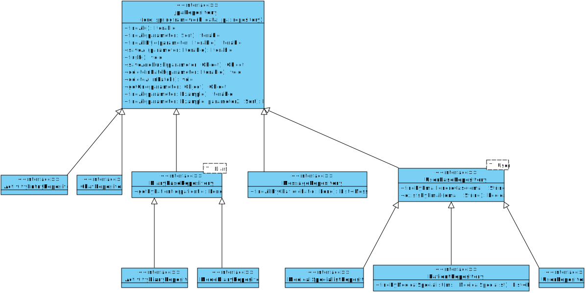
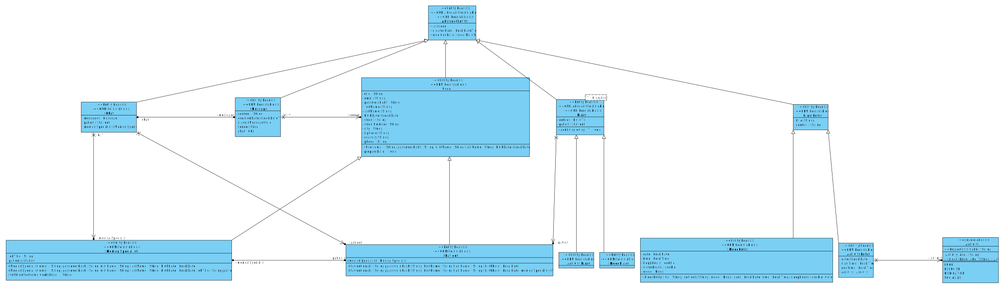
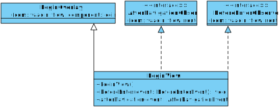
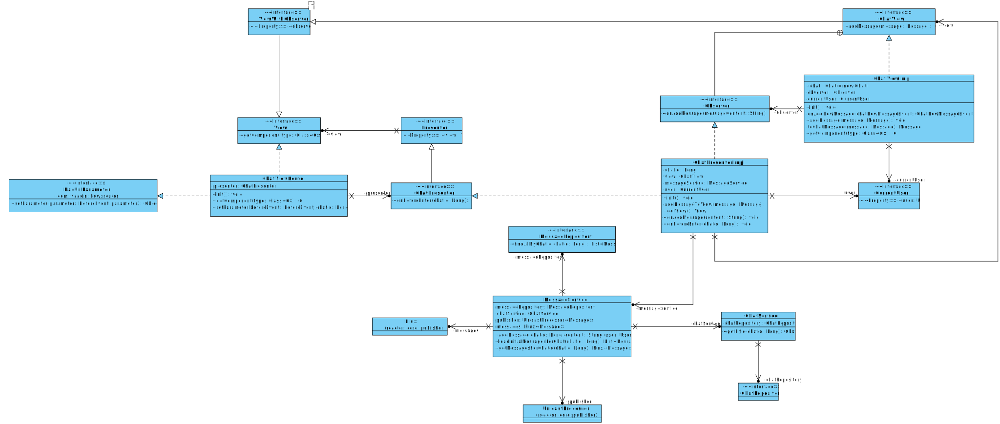
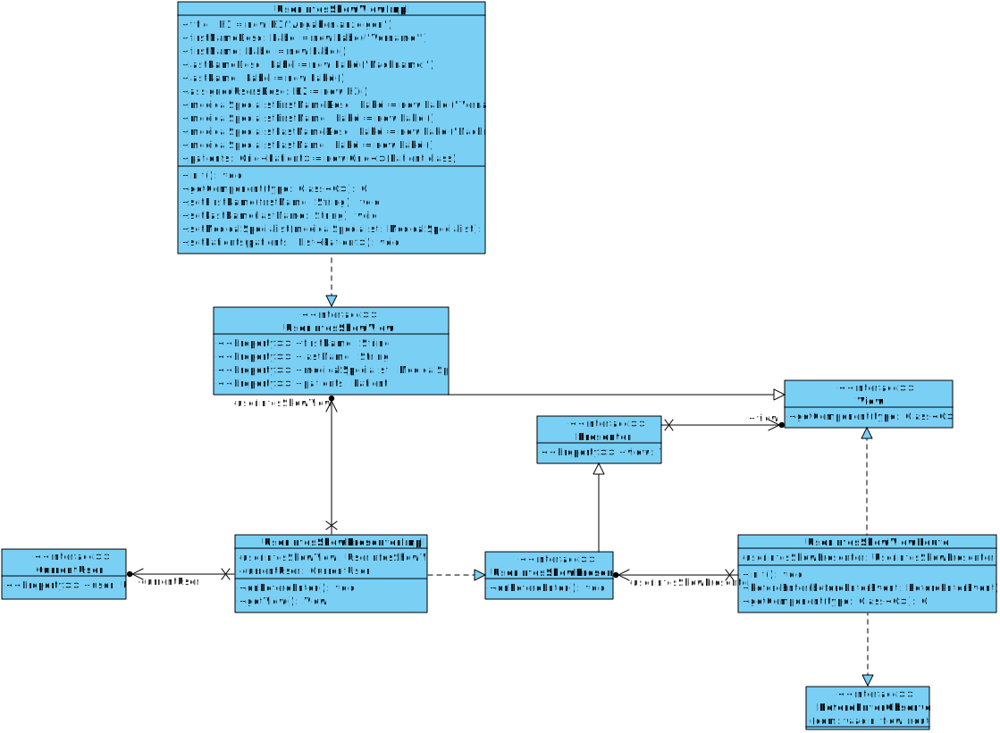
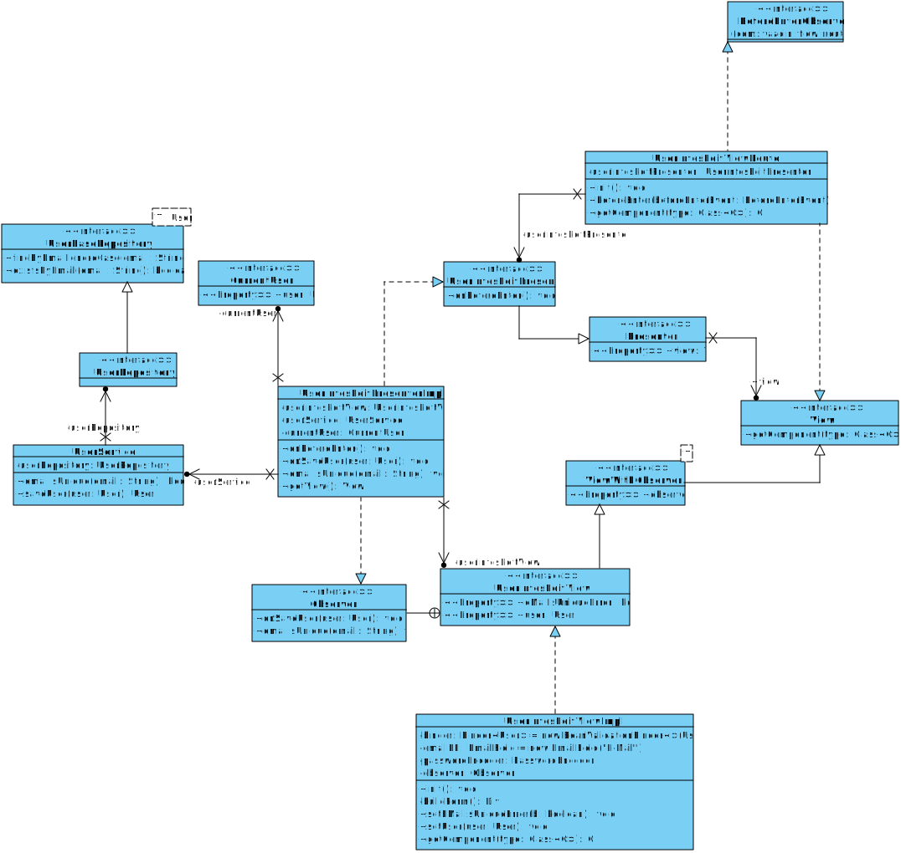
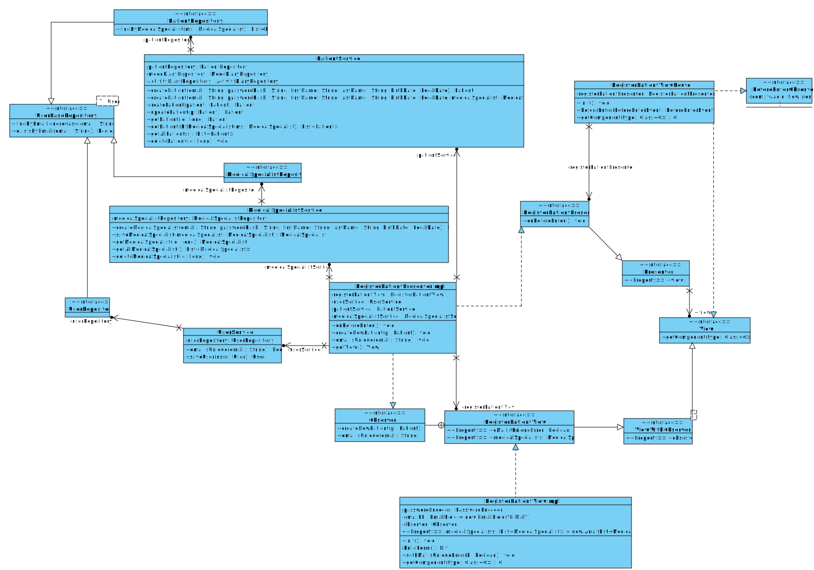
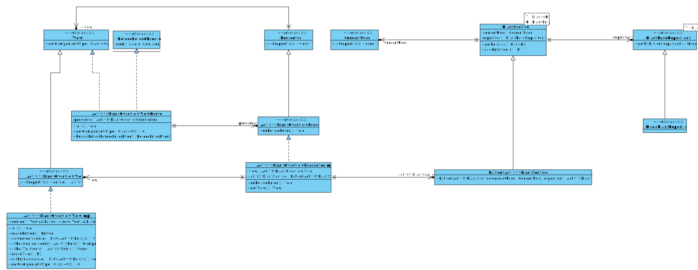
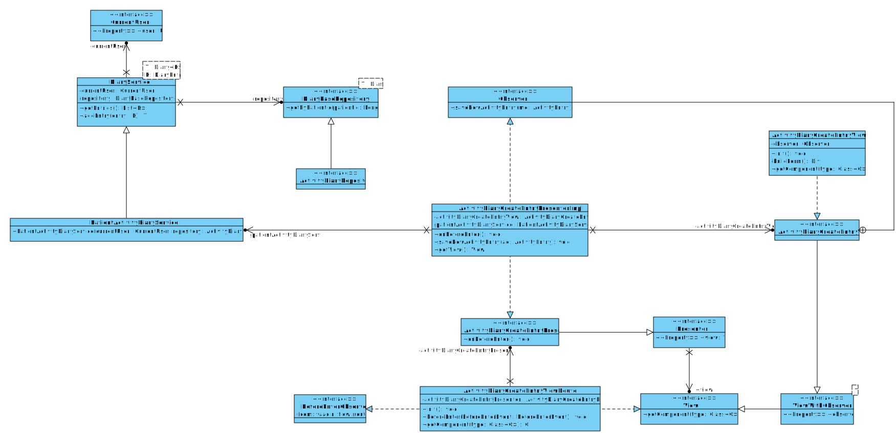

## Klassendiagramm für Datenbankzugriff
Umgesetzt mit `spring-data`, daher `JpaRepository`

## Model / Entities
Umgesetzt mit JPA, daher entsprechende Typen/Annotations

### Features

#### Login

#### Chat
`UnicastProcessor` und `Flux` von Reactive Programming (Project Reactor)

#### Anzeige Benutzerinfo

#### Bearbeiten Benutzerinfo

#### Patient registrieren

#### Aktivitätstagebuch Übersicht

#### Aktivitätstagebuch Eintrag erstellen

#### Stimmungstagebuch
Da fast genau gleich (bis auf UI Visualisierung) wie Aktivitätstagebuch, wird darauf verzichtet dies noch seperat zu visualisieren.

## Code
Der Code zum Klassendiagramm befindet sich unter https://github.com/soed2020-teamorange/ch.bfh.bti7081.s2020.orange/tree/master/src/main/java/ch/bfh/bti7081/s2020/orange/backend
